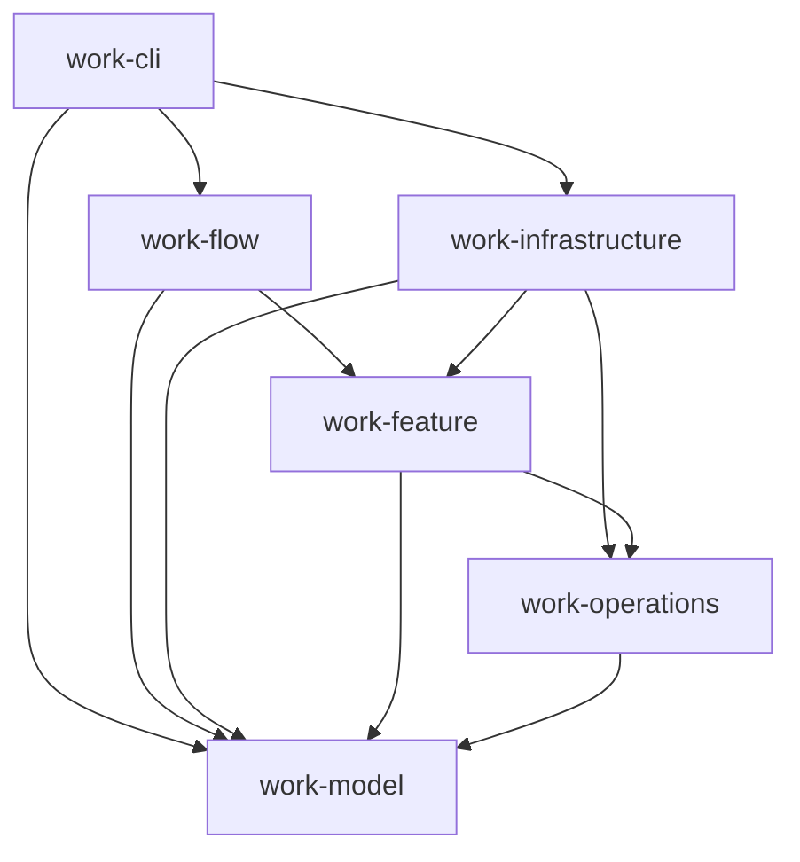
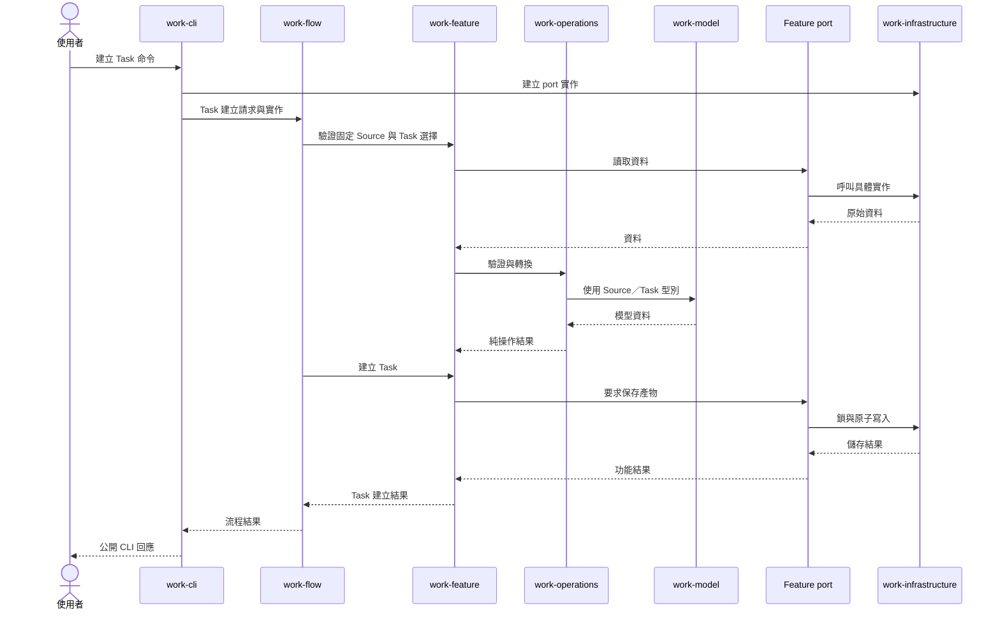

# Work Rust 目標架構

## 1. 目的與範圍

本文件定義 Work CLI 的六 crate 架構，供開發與維護時判斷程式應放在哪個 crate、可以依賴哪些 crate，以及如何驗證邊界。workspace 由下列六個 crate 組成；模組與介面示例僅說明責任，不指定實際函式名稱。

文件聚焦 Work 的六個 Rust crate。安裝器負責從來源建置 `work-cli` 並安裝 binary；安裝、升級及平台支援的細節由安裝文件說明。Workspace 使用 Rust 2024 edition，最低支援 stable Rust 1.85，並以 `Cargo.lock` 鎖定建置。

## 2. Crate 職責與依賴方向

| Crate | 職責 | 允許直接依賴的其他 Work crate |
| --- | --- | --- |
| `work-model` | 定義資料型別、欄位結構、公開資料契約的 `struct`／`enum` 與單一型別的基本不變條件。 | 無 |
| `work-operations` | 以模型實作純驗證、跨模型計算、轉換、canonical bytes 與指紋。 | `work-model` |
| `work-feature` | 提供單一功能的業務入口，組合純操作並定義取得外部資料所需的 ports。 | `work-operations`、`work-model` |
| `work-flow` | 組合功能，提供所有公開命令的流程入口。 | `work-feature`、`work-model` |
| `work-infrastructure` | 實作 Feature ports，以及檔案、Git、程序、時鐘、鎖、交易與復原等外部能力。 | `work-feature`、`work-operations`、`work-model` |
| `work-cli` | 解析命令、組裝 Flow 與 Infrastructure，將流程結果轉成公開輸出。 | `work-flow`、`work-infrastructure`、`work-model` |

這是**允許清單**，不是每個 crate 必須加入的依賴。任何未列出的 Work crate 直接依賴都違反目標架構；不得藉由重新匯出或測試依賴引入反向邊。上層可以直接使用允許的底層模型型別，但業務行為須經指定入口：CLI 啟動 Flow，Flow 呼叫 Feature，Feature 呼叫 Operations。Flow 不直接執行 Operations；CLI 不直接執行 Feature 或 Operations。Infrastructure 可以使用純操作處理儲存資料，不決定業務流程。

箭頭表示**程式碼依賴**，不是執行時資料只能往箭頭方向移動。呼叫結果與錯誤會返回呼叫端；這不構成反向 crate 依賴。同一 crate 內可以按業務概念分模組，也可以互相引用；本架構強制的是六個 crate 之間的方向，不宣稱已限制 crate 內所有模組引用。

## 3. 呼叫、資料與 port

1. CLI 將命令輸入轉成 Flow 所需的請求，建立 Infrastructure 的具體實作，並把它們交給 Flow。所有公開命令都從 Flow 進入；只涉及單一 Feature 的命令仍保留薄的 Flow 入口。
2. Flow 決定流程順序、組合所需的 Feature，並可使用 Model 型別作為輸入與輸出。Flow 不直接操作檔案、Git、程序或純操作函式。
3. Feature 負責單一功能的業務行為，使用 Operations 及自己定義的 port 介面。port 描述功能需要什麼資料或外部效果，不指定檔案與 Git 等能力的具體實作。
4. Operations 只依賴 Model，處理不需要檔案、Git、環境或程序的規則。Model 維護型別本身的基本不變條件；跨欄位、跨模型的驗證與轉換放在 Operations。
5. Infrastructure 實作 Feature ports。CLI 是 composition root，負責將這些實作接到 Flow；Feature 與 Flow 均不依賴 Infrastructure。

## 4. 模組與公開 API

每個 crate 內按業務概念組織模組，而非按技術動作平鋪。例如 Task 可對應 `work_model::task`、`work_operations::task`、`work_feature::task` 與 `work_flow::task_creation`。這些是目標命名示例，不要求每個業務概念在所有 crate 都有模組，也不增加 `work-feature-task` 等按功能拆出的 crate。

各 crate 僅公開上層需要的型別、port 與入口；內部實作優先保持私有或使用 `pub(crate)`。Model 定義資料形狀與欄位契約；Operations 定義 canonical 序列化、指紋等演算法。公開 API 不應讓呼叫端繞過 Flow／Feature 的業務入口。

正式 artifact 的跨檔案指紋、交易 snapshot／approval／ID、歷史證據 policy，以及 journal、marker、receipt 的衍生規則由 `work-operations::derivation` 擁有。Feature 提交語意變更與 candidate，Infrastructure 提供原始 bytes 並負責持久化和復原；兩者不得另建相同衍生演算法。既有 Attempt、Correction、授權與核准證據只驗證或保留，不因目前來源變動而回寫。`work-cli/tests/derivation_architecture.rs` 檢查已遷移的責任，防止 caller 重新加入本地 hash、交易鏈或 marker 實作。

### 公開資料契約的型別化實作

公開 schema ID、PublicSchema variants、ALL、serde、registry 與 producer/validator 只定義目前的無版本契約，不保留版本 alias 或舊 DTO 分支。一般 Task／Revise／Execute 輸入仍須通過 unknown-field、canonical bytes、路徑、layout 與跨檔案 binding 驗證。Migration 只把不相容或損毀內容當作 exact raw evidence；經審查的替代內容必須重新通過 current candidate 驗證，沒有歷史 parser 或 upgrade chain。

1. `work-model/src/` 按 Source、Task、Execution、Specification 等業務概念，定義已登錄公開 request、artifact、response 與 envelope 的 Rust `struct`／`enum` 及固定巢狀物件。契約允許任意 JSON 的欄位保留 `Value`；其餘欄位以 `serde` 表達欄名、可選、`null` 與 enum 字面值。
2. `work-model/src/contract_data.rs` 以 Rust 程式碼保存公開契約的描述、範例、scaffold 及欄位順序，並建構型別化的契約目錄。CLI 的 `contract list`、`describe`、`scaffold` 從該目錄取資料，仍負責輸出映射與呈現。
3. Operations 仍負責跨欄位驗證、canonical bytes、SHA 與指紋；Feature／Flow 保留 ports、功能及流程所需的暫時性輸入。已知的公開資料形狀由 Model 表達，生產路徑於邊界解析／產生對應型別。型別化不得改變 schema、輸出欄位順序、缺漏／未知／`null` 行為、exit code、reason code、持久化內容或復原語意。
4. `work-cli/src/parser/commands.json` 是命令樹與 help 設定，留在 CLI；`work-operations/src/routing_catalog.json`、`operation_effects.json` 是純規則資料，留在 Operations。測試 fixture 與 golden JSON 保持測試用途，不搬入 Model。這三份執行用設定透過 `include_str!` 編入 binary，不需要在使用者環境另外交付。

## 5. 錯誤、交易與復原

各層定義自己的型別化錯誤。下層回傳錯誤，上層在自己的邊界補充脈絡或轉換，不讓底層引用上層錯誤型別。Infrastructure 實作 port 時，將技術錯誤轉為該 port 約定的錯誤；CLI 集中映射公開的 exit code、`reason_code`、訊息及輸出格式。

Flow／Feature 決定業務步驟、授權與狀態結果；Infrastructure 保證持久化所需的鎖、原子寫入與中斷復原。Infrastructure 可以使用 Operations 中的純轉換，但不得自行改變業務決策。復原結果經 port 回到 Feature／Flow，再由 CLI 轉成公開回應。

## 6. 建立 Task：資料流示例

下圖說明各 crate 的責任與資料流，不代表實際函式名稱或每一步的固定呼叫路徑。Source 捕捉與 Task 規劃是獨立 Feature；Flow 組合固定來源、確認選擇、驗收與正式集合建立。

若寫入中斷或失敗，Infrastructure 依儲存契約處理鎖、暫存資料及復原，並從 port 回報結果或錯誤。Feature／Flow 依業務規則決定可否完成、重試或拒絕；CLI 將最後結果映射為穩定的公開錯誤。復原可能發生在後續呼叫，不要求所有失敗都能在同一次命令內完成復原。

## 7. 測試責任與架構驗證

1. `work-model` 測型別與基本不變條件；`work-operations` 測純規則、canonical bytes 與指紋，使用固定輸入與輸出。
2. `work-feature` 以 fake ports 測功能行為；`work-flow` 以 fake ports 測流程順序、組合與錯誤傳遞，不啟動 CLI 或真實檔案系統。
3. `work-infrastructure` 以真實檔案、Git 或程序測 adapter、鎖、交易、失敗注入及復原；`work-cli` 測命令解析、組裝與程序邊界的輸出契約。
4. `work-cli/tests/architecture_dependencies.rs` 讀取 Cargo 依賴圖，檢查上述六個 Work crate 之間的一般、build、dev 直接邊，逐一比對第 2 節的允許清單；未列出的邊使測試失敗，清單中的邊不必全部出現。
5. 以 workspace 的格式檢查、Clippy、測試及架構依賴檢查驗收；不得以 macOS 測試結果宣稱 Windows 已實測。

### 衍生資料的使用時機與完整測試前檢查

`work-operations/src/derivation/` 是 Rust 模組，不是獨立的重算命令。當 Source、TASK、Execution、Specification 的來源 bytes 或其衍生規則改變時，Feature／Infrastructure 應透過此模組的 API 計算或核對受影響的指紋、跨檔案綁定、交易資料與出版標記；不要在呼叫端另寫 hash 或手動填入指紋。`graph::reconcile_artifact_bindings` 處理目前 Source／Task selections → TASK → Execution 的綁定；`fingerprint` 提供各 artifact 的指紋入口。歷史核准與執行證據依既有 policy 驗證，不因目前來源變更而重新產生。

最後一次 workspace 完整測試前，依下列順序檢查受變更影響的現行測試資料：

1. Task 建立測試：以 `fingerprint::discussion_session` 核對已提交 Session 的內容 SHA；直接生成正式集合時，以 `fingerprint::discussion_approval` 綁定 Session 與全部 canonical target bytes，計算 `approval_sha256`。兩者的輸入與用途不同，應各自對照對應欄位，不直接比較彼此。若合成測試資料與保存後資料不一致，先修正測試資料的產生流程並重跑相關測試。
2. Specification 測試：以現行 fixture 的 Source proof、TASK index、Execution index 與 Task item 原始 bytes，經 `fingerprint::specification_baseline` 重算 `expected`，再核對測試請求。若來源檔已變更，透過現有產生流程更新現行 fixture 的相依指紋與預期結果；不要改寫歷史 fixture 或既有核准證據。
3. 先執行受影響的 Task／Specification 測試，確認衍生值與資料契約一致；通過後再執行第 5 點所列的 workspace 完整驗證。僅修改文件且未影響 artifact 或指紋規則時，確認沒有需要重算的測試資料即可。

## 8. Source、驗收與維護入口

Instruction routing/source selections 不保存 compatibility revision 或 router revision；canonical source bytes 與 SHA drift 仍須檢核。有效集合的明確 instruction/selection 變更走 Revise，無可信 current baseline 時使用 public Migration。已移除的 instruction refresh/migration fresh writer 不再產生交易；instruction recover 只完成既有且核准綁定一致的 current journal。

macOS／Windows installer 從空的 prepared 目錄建立 current base、本次選取 hierarchy 與 binary，驗證後以目錄 rename 發布。完整舊安裝保留於 previous；準備／備份失敗不改 active tree，發布失敗嘗試回復，回復失敗保留 previous。Windows 本輪僅靜態檢查，不能據此宣稱 cmd.exe、權限或 rename 已實測。

1. 四種 public invocation mode 為 task／revise／migration／execute；explicit 與 implicit_confirmed 都保留精確 request，後者需要使用者確認證據。私人 role envelope 和 invocation 都不授權寫入或執行。
2. Source capture 保存精確原始 bytes、manifest 與完成標記，使用 exclusive create、writer lock 及 readback；Task 的 planning_source 固定指向同一 snapshot，獨立保存 hierarchy、skill selection 與主驗收。正式集合是 index 加每個 TASK item，item 另有子驗收；VAL 必須覆蓋兩層驗收。
3. Revise 發布完整 Source／TASK／Execution 候選，Source replacement 先確認整體需求、主驗收及逐 TASK 影響。衍生規則重新推導受影響／下游狀態與驗收，原 Source、Attempt、Correction 與交易歷史只驗證及保留。
4. Migration analyze 比較原始 raw evidence 與目前契約。Semantic prepare 嚴格接收已審查 sources 與語意決策，保留有效 snapshot 或明確核准無 Source provenance；只產生 Task index/items 與 Execution candidates，不把歷史證據當可寫目標。
5. Preview approval 綁定全部 candidates、sources、relationships 及 applicable history。Apply／recover 在同一 writer lock 邊界重驗，verify 核對 canonical journal、marker、installed bytes 與完整指紋鏈；跨檔案逐步發布可復原，不宣稱檔案系統全組原子性。Reconciliation ledger 與 nested migration 使用同一完整核准集合。
