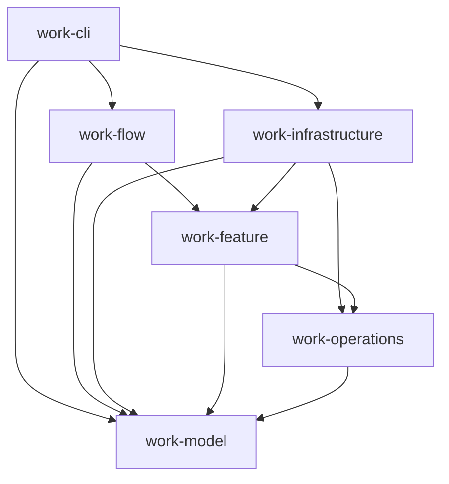
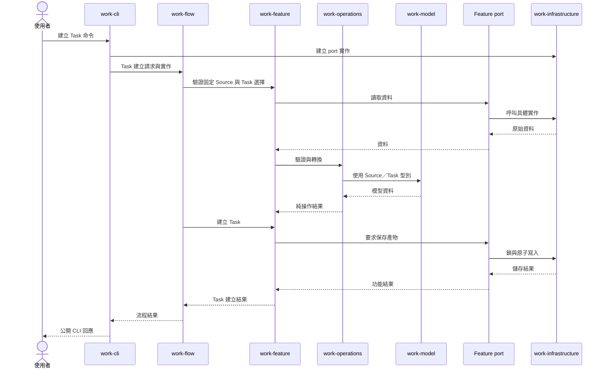

# Work Rust 架構

## 1. 目的與範圍

本文件定義 Work CLI 的六 crate 架構，供開發與維護時判斷程式應放在哪個 crate、可以依賴哪些 crate，以及各層如何協作。workspace 由下列六個 crate 組成；模組與介面示例僅說明責任，不指定實際函式名稱。

Workspace 由六個 Rust crate 組成，以 Model、Operations、Feature、Flow、Infrastructure 與 CLI 分離資料契約、純規則、業務功能、流程組合、外部能力及命令入口。

## 2. Crate 職責與依賴方向

| Crate | 職責 | 允許直接依賴的其他 Work crate |
| --- | --- | --- |
| `work-model` | 定義資料型別、欄位結構、公開資料契約的 `struct`／`enum` 與單一型別的基本不變條件。 | 無 |
| `work-operations` | 以模型實作純驗證、跨模型計算、轉換、canonical bytes 與指紋。 | `work-model` |
| `work-feature` | 提供單一功能的業務入口，組合純操作並定義取得外部資料所需的 ports。 | `work-operations`、`work-model` |
| `work-flow` | 組合功能，提供所有公開命令的流程入口。 | `work-feature`、`work-model` |
| `work-infrastructure` | 實作 Feature ports，以及檔案、Git、程序、時鐘、鎖、交易與復原等外部能力。 | `work-feature`、`work-operations`、`work-model` |
| `work-cli` | 解析命令、組裝 Flow 與 Infrastructure，將流程結果轉成公開輸出。 | `work-flow`、`work-infrastructure`、`work-model` |

這是**允許清單**，不是每個 crate 必須加入的依賴。任何未列出的 Work crate 直接依賴都違反目標架構；不得藉由重新匯出或測試依賴引入反向邊。上層可以直接使用允許的底層模型型別，但業務行為須經指定入口：CLI 啟動 Flow，Flow 呼叫 Feature，Feature 呼叫 Operations。Flow 不直接執行 Operations；CLI 不直接執行 Feature 或 Operations。Infrastructure 可以使用純操作處理儲存資料，不決定業務流程。

箭頭表示**程式碼依賴**，不是執行時資料只能往箭頭方向移動。呼叫結果與錯誤會返回呼叫端；這不構成反向 crate 依賴。同一 crate 內可以按業務概念分模組，也可以互相引用；本架構強制的是六個 crate 之間的方向，不宣稱已限制 crate 內所有模組引用。

## 3. 呼叫、資料與 port

1. CLI 將命令輸入轉成 Flow 所需的請求，建立 Infrastructure 的具體實作，並把它們交給 Flow。所有公開命令都從 Flow 進入；只涉及單一 Feature 的命令仍保留薄的 Flow 入口。
2. Flow 決定流程順序、組合所需的 Feature，並可使用 Model 型別作為輸入與輸出。Flow 不直接操作檔案、Git、程序或純操作函式。
3. Feature 負責單一功能的業務行為，使用 Operations 及自己定義的 port 介面。port 描述功能需要什麼資料或外部效果，不指定檔案與 Git 等能力的具體實作。
4. Operations 只依賴 Model，處理不需要檔案、Git、環境或程序的規則。Model 維護型別本身的基本不變條件；跨欄位、跨模型的驗證與轉換放在 Operations。
5. Infrastructure 實作 Feature ports。CLI 是 composition root，負責將這些實作接到 Flow；Feature 與 Flow 均不依賴 Infrastructure。

## 4. 模組與公開 API

每個 crate 內按業務概念組織模組，而非按技術動作平鋪。例如 Task 可對應 `work_model::task`、`work_operations::task`、`work_feature::task` 與 `work_flow::task_creation`。這些是目標命名示例，不要求每個業務概念在所有 crate 都有模組，也不增加 `work-feature-task` 等按功能拆出的 crate。

各 crate 僅公開上層需要的型別、port 與入口；內部實作優先保持私有或使用 `pub(crate)`。Model 定義資料形狀與欄位契約；Operations 定義 canonical 序列化、指紋等演算法。公開 API 不應讓呼叫端繞過 Flow／Feature 的業務入口。

`work-operations::derivation` 集中定義跨檔案指紋、交易身分與衍生資料演算法。Feature 組合這些純操作，Infrastructure 提供原始 bytes 與持久化能力；衍生演算法不在呼叫端重複實作。

### 公開資料契約的型別化實作

Model 以 Rust 型別及 `serde` 定義公開資料契約，Operations 提供契約驗證與 canonical 序列化，CLI 負責公開輸出的呈現。

1. `work-model/src/` 按 Source、Task、Execution、Specification 等業務概念，定義已登錄公開 request、artifact、response 與 envelope 的 Rust `struct`／`enum` 及固定巢狀物件。契約允許任意 JSON 的欄位保留 `Value`；其餘欄位以 `serde` 表達欄名、可選、`null` 與 enum 字面值。
2. `work-model/src/contract_data.rs` 以 Rust 程式碼保存公開契約的描述、範例、scaffold 及欄位順序，並建構型別化的契約目錄。CLI 的 `contract list`、`describe`、`scaffold` 從該目錄取資料，仍負責輸出映射與呈現。
3. Operations 仍負責跨欄位驗證、canonical bytes、SHA 與指紋；Feature／Flow 保留 ports、功能及流程所需的暫時性輸入。已知的公開資料形狀由 Model 表達，生產路徑於邊界解析／產生對應型別。公開契約的解析與輸出集中於邊界，業務層使用對應的模型型別。
4. `work-cli/src/parser/commands.json` 是命令樹與 help 設定，留在 CLI；`work-operations/src/routing_catalog.json`、`operation_effects.json` 是純規則資料，留在 Operations。測試 fixture 與 golden JSON 保持測試用途，不搬入 Model。這三份執行用設定透過 `include_str!` 編入 binary，不需要在使用者環境另外交付。

## 5. 錯誤、交易與復原

各層定義自己的型別化錯誤。下層回傳錯誤，上層在自己的邊界補充脈絡或轉換，不讓底層引用上層錯誤型別。Infrastructure 實作 port 時，將技術錯誤轉為該 port 約定的錯誤；CLI 集中映射公開的 exit code、`reason_code`、訊息及輸出格式。

Flow／Feature 決定業務步驟、授權與狀態結果；Infrastructure 保證持久化所需的鎖、原子寫入與中斷復原。Infrastructure 可以使用 Operations 中的純轉換，但不得自行改變業務決策。復原結果經 port 回到 Feature／Flow，再由 CLI 轉成公開回應。

## 6. 建立 Task：資料流示例

下圖說明各 crate 的責任與資料流，不代表實際函式名稱或每一步的固定呼叫路徑。Source 捕捉與 Task 規劃是獨立 Feature；Flow 組合固定來源、確認選擇、驗收與正式集合建立。

若寫入中斷或失敗，Infrastructure 依儲存契約處理鎖、暫存資料及復原，並從 port 回報結果或錯誤。Feature／Flow 依業務規則決定可否完成、重試或拒絕；CLI 將最後結果映射為穩定的公開錯誤。復原可能發生在後續呼叫，不要求所有失敗都能在同一次命令內完成復原。

## 7. 外部能力與儲存介面

Feature 透過 repository 與 port 介面取得執行能力、來源資料及儲存結果。Infrastructure 按外部系統與平台組織 adapter，封裝檔案 metadata、程序執行、資源查詢與持久化實作；平台 API 不進入 Model、Operations、Feature 或 Flow。

Runtime 的 owner、manifest 與 inventory 型別由 Model 定義，路徑、身分及指紋規則由 Operations 定義。Infrastructure 實作 workspace 配置、writer lock、交易暫存、journal、回讀與復原；CLI 透過 Flow 與 Feature 使用這些能力。

正式 argv 命令由 Infrastructure 的可信 executor 提供隔離能力，將原生 backend、專案唯讀來源與實際 read view、本次 Attempt／record 的 staging 與禁止網路政策綁入核准預覽。macOS 使用 Seatbelt；Windows 使用 LPAC 與不可脫離的 Job Object，僅對隔離專案副本及 staging 配置權限，不改原始專案 ACL。命令只能在 staging 產生候選，正式檔案仍經完整檔案交易發布；隔離建立失敗不回退至一般 host runner。手動驗收沿用原流程，未知 OP、automated VAL 及沒有原生 backend 的平台保持拒絕。

Windows 唯讀副本有容量限制，拒絕 reparse point／特殊檔案；原始專案的絕對路徑及隔離中不可讀取的工具依賴可能使命令失敗。macOS 自訂 Seatbelt API 已棄用，支援與實測範圍記錄於 task 文件。這些 adapter 不保證其他本機程序不修改專案，也不把未執行的平台測試視為通過。
